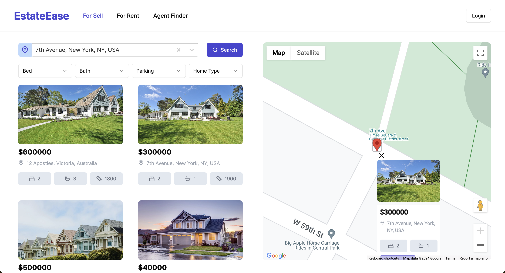

# EstateEase

## About the Project

EstateEase is a comprehensive real estate platform designed to streamline the process of discovering and listing properties for sale or rent.

## Tech Stack

- **Authentication**: Clerk
- **Frontend**: Next.js, Tailwind CSS, Shadcn
- **Backend**: Supabase
- **Map Integration**: Google Maps API
- **Location Search**: Google Places Autocomplete

## Features

- **Location Search**: User-friendly location search using Google Places Autocomplete.
- **Advanced Search Functionality**: Search by property type, price range, and location.
- **Filter Results**: Filter by number of bedrooms, bathrooms, and more.
- **Property Details**: View comprehensive details, multiple images, and location on a map.
- **User Authentication**: Secure login prompts and easy navigation.
- **Property Management**: Robust portal for property managers to manage listings, update details, and upload images.

## Live Demo

Check out the live demo: [EstateEase](https://rent-real-estate.vercel.app/)
